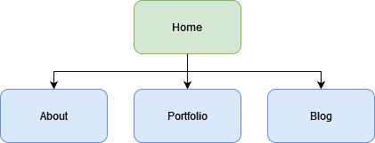
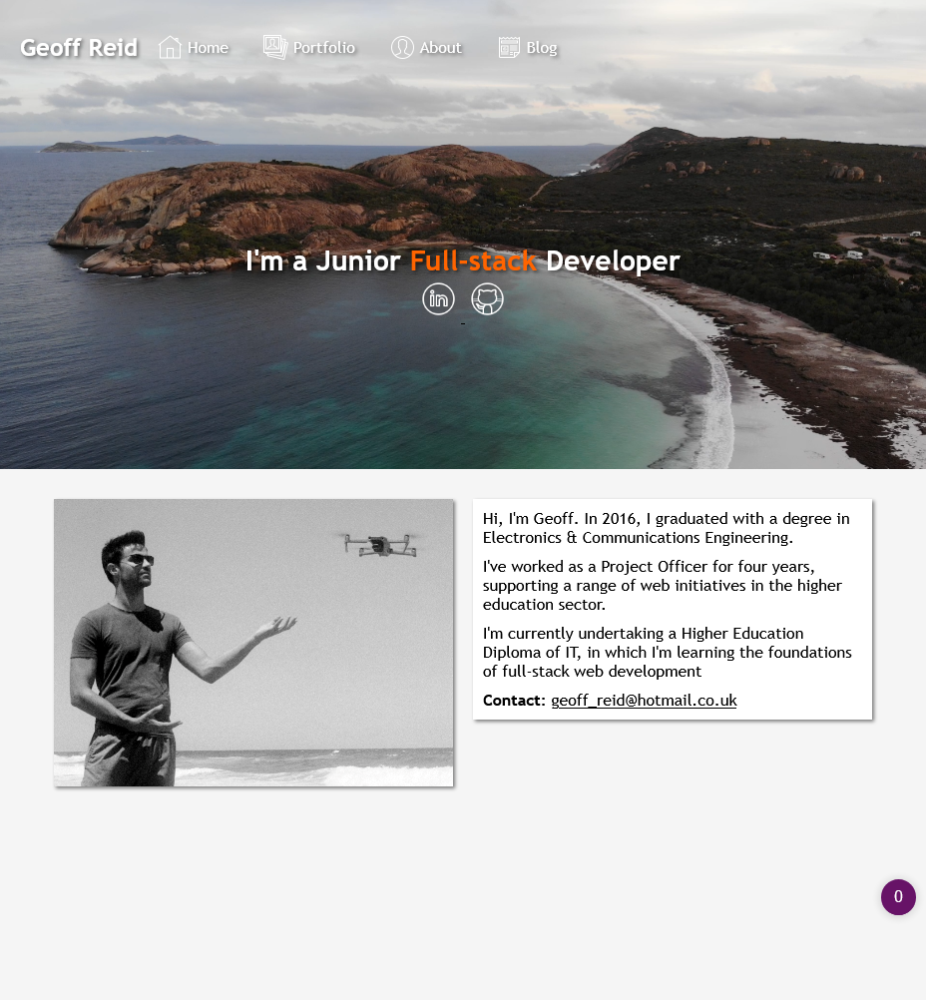
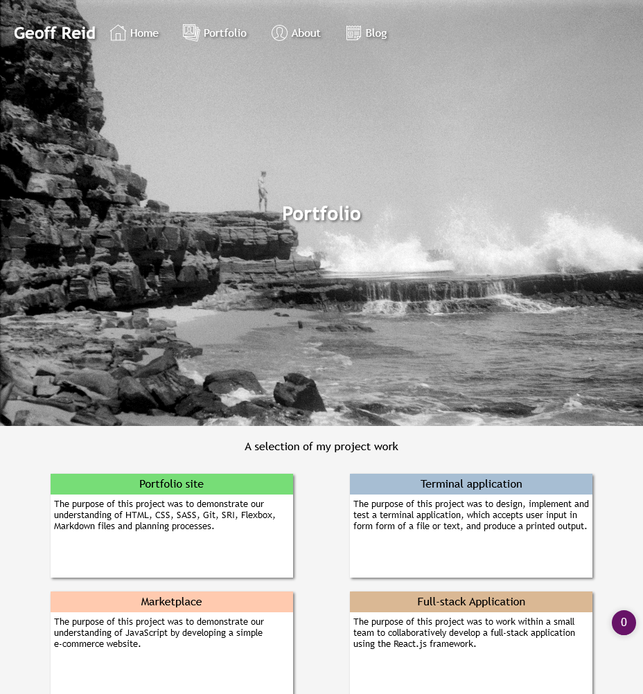
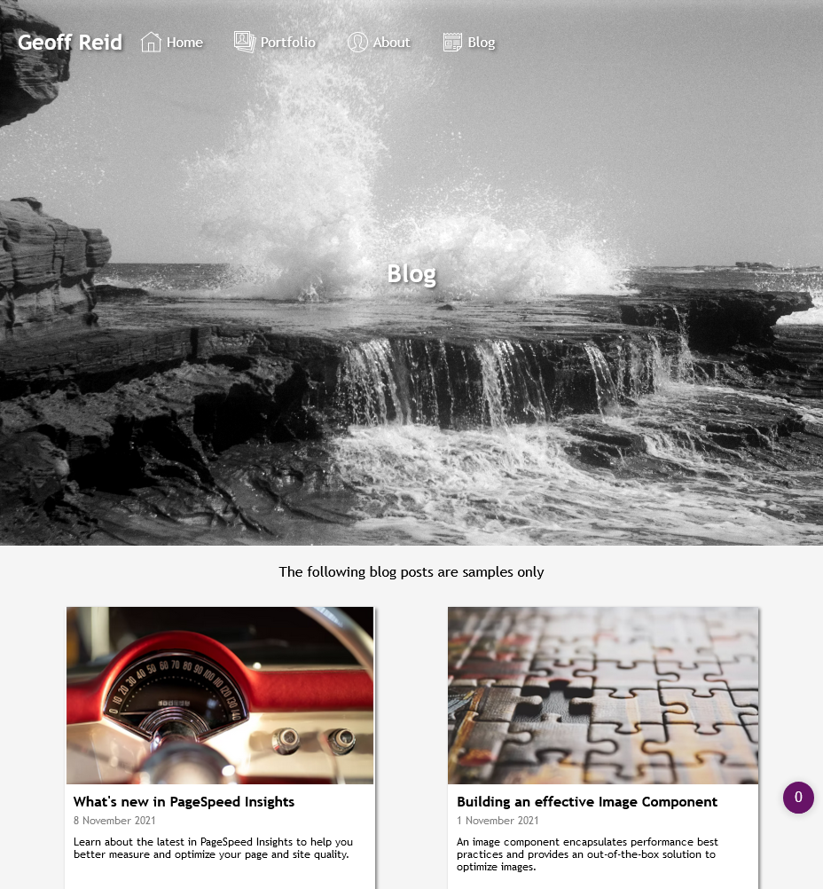
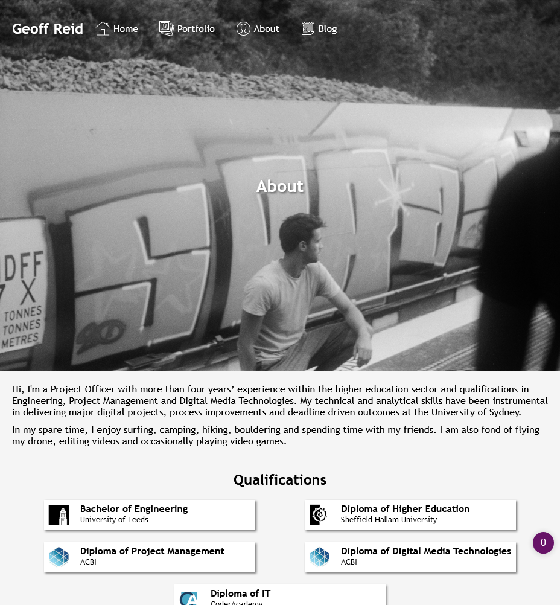

# Portfolio Site (T1A2)

**Author:** Geoff Reid&nbsp;&nbsp;&nbsp;&nbsp; **Date:** 11 November 2021&nbsp;&nbsp;&nbsp;&nbsp; **GitHub repository:** <a href="https://github.com/LetTheWookieWin92/PortfolioSite">View</a>&nbsp;&nbsp;&nbsp;&nbsp; **Published site:** <a href="https://geoff-reid-portfolio.netlify.app/">View</a>

## Purpose

The purpose of this project is to design and build a personal portfolio site, which presents me as a developer and IT professional. The site includes information about me, my skills, professional knowledge and a showcase of my work. The site itself demonstrates a range of skills that are required to work in the industry.
  

## Functionality and features

1. Modern, fully responsive page design for all screen sizes and orientations, using Figma. Implemented using Flexbox.
2. Four distinct pages (Home, About, Portfolio and Blog), which share a common theme and utilise re-usable components and variables, using SASS.
3. A range of bespoke interface components, designed to maximise user readability and comprehension. Including styled graphical and text content.
4. Access to professional history, blog posts and contact information.
5. Base64-coded cryptographic hash subresource integrity enabled.
6. Use of semantic HTML elements, which clearly describe their meaning to the browser and developer.
7. Developed using git source control.

 

## Sitemap

 

## Screenshots

 

## Target audience

The target audience for the portfolio website is an employer looking to engage a dev and/or IT professional. The employer has technical knowledge relating to information technology, software development/coding, programming languages and development stacks, as well as high expectations of professionalism and a positive work ethic.

 

## Tech stack

This project was built using the following:

- HTML
- CSS
- SASS
- Netlify (deployment platform)
